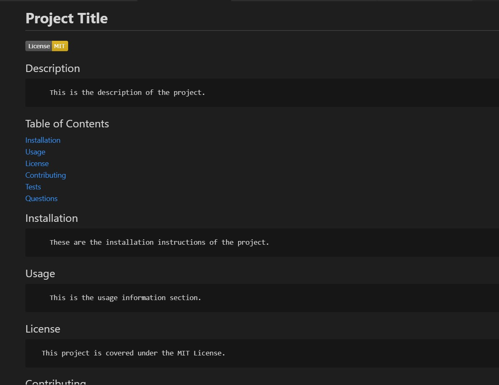

# Node.js Challenge: Professional README Generator

## Description

```
The README.md generator was created to ease the process of creating a README.md file for future <br />
projects. It accepts information about the project, including the title, description, licenses, etc., <br />
and then it compiles all of that information into a README template.
```

## User Story

```
AS A developer
I WANT a README generator
SO THAT I can quickly create a professional README for a new project
```

## Acceptance Criteria

```
- It is done when the user is prompted for information about their application repository, <br />
including but not limited to description, installation instructions, usage information, <br />
contribution guidelines, and test instructions. After answering all prompts, a high-quality, <br />
professional README.md is generated with the title of the project and sections entitled Description, <br />
Table of Contents, Installation, Usage, License, Contributing, Tests, and Questions. All answered <br />
prompt information is then also populated in the appropriate sections.

- It is done when after a user enters their project title, it displays as the title of the README.

- It is done when the user chooses a license for the application from a list of options and then a <br />
badge for that license is added near the top of the README and a notice is added to the section of <br />
the README entitled License that explains which license the application is covered under.

- It is done when the user enters their GitHub username and it is added to the section of the README <br />
entitled Questions, with a link to their GitHub profile.

- It is done when the user enters their email address and it is added to the section of the README <br />
entitled Questions, with instructions on how to reach the user with additional questions.

- It is done when a user clicks on the links in the Table of Contents and is taken to the corresponding <br />
section of the README.

```

## Walkthrough Video

```
https://drive.google.com/file/d/1vYTC_ezEAwotbY_Doi91ilA7e0hiHnaD/view
```

The following images demonstrates the application functionality:




## Review

You are required to submit the following for review:

- A walkthrough video demonstrating the functionality of the application: https://drive.google.com/file/d/1vYTC_ezEAwotbY_Doi91ilA7e0hiHnaD/view

- A sample README.md file for a project repository generated using your application: https://github.com/sstover25/README_generator/tree/main/dist

- The URL of the GitHub repository: https://github.com/sstover25/README_generator

---

## Installation

```
To use this applicaiton, you must have Node.js installed as well as Inquirer installed.

```

## Credits

```
Coding assistance from KU bootcamp modules, https://developer.mozilla.org/, <br />
w3Schools documentation, Inquirer documentation, and Stack Overflow.

Information about licenses came from https://gist.github.com/lukas-h/2a5d00690736b4c3a7ba

```

© 2021 Trilogy Education Services, LLC, a 2U, Inc. brand. Confidential and Proprietary. All Rights Reserved.
